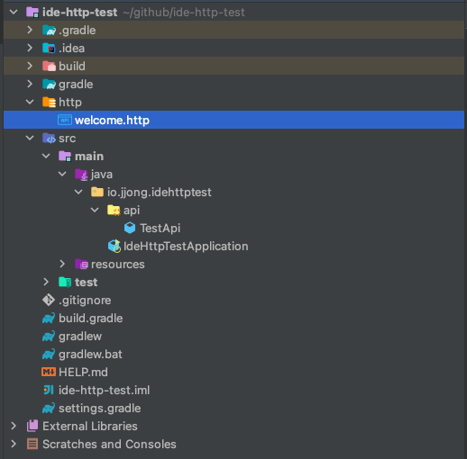
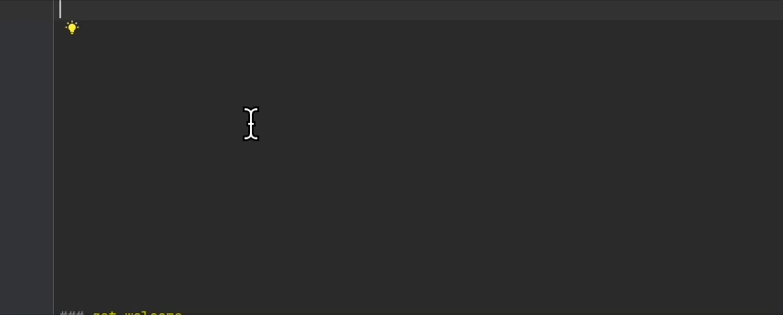
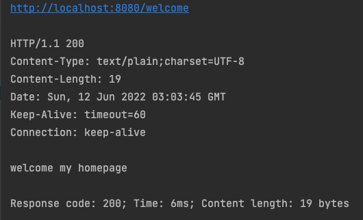
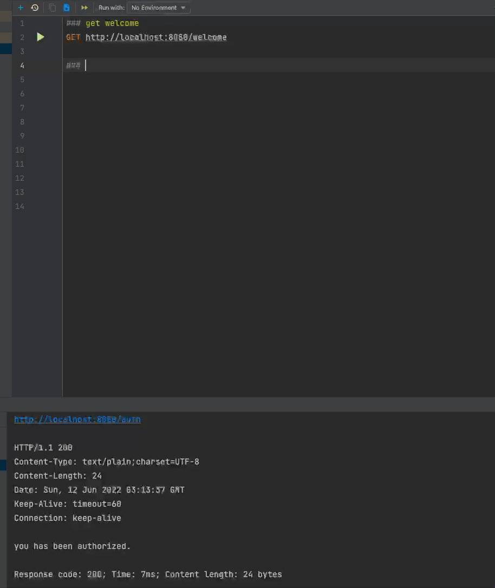
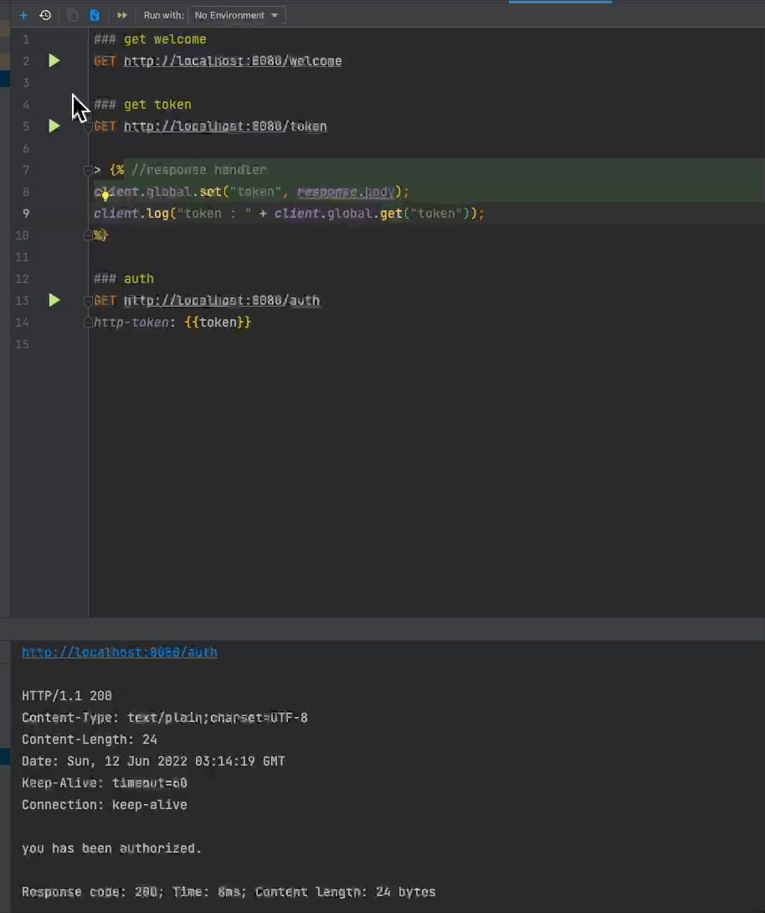

# IntelliJ http client 활용 하기

# Synopsis

API 를 테스트 할 때 기본적으로 `브라우저`에서 테스트 할 수 있다. GET의 경우에는 손쉽게 테스트를 할 수 있지만 다른 Method 예를 들어 `POST`를 테스트 해야 한다면 아마 주로 `Postman`을 많이 사용할 것이다. `IntelliJ` 에서 제공하는 `Http Client`를 사용하게 되면 여러 도구를 돌아다니지 않고 `IDE 툴 내에서 바로 테스트`가 가능하다. 그리고 매우 높은 수준의 테스트도 가능하다.  이를 활용하는 방법에 대해서 알아 보자.

# Goal

- 간단한 Api 서버를 구축 한다.
- 토큰을 조회하는 Api 를 구현한다.
- 조회한 토큰을 이용하여 특정 Api 를 호출하는 기능을 구현한다.
- 이를 http client테스트로 구현하고 테스트 하는 것을 자동화해 본다.

# Create project

아래 스펙을 이용해서 간단하게 spring boot api server를 구축한다.

- spring boot 2.7
- java 17

매우 간단한 Api 소스이다. 이 로직을 실제 프로젝트에 사용하는 것은 `매우 위험`하다. 실습용으로 이해하자.

```java
@RestController
@Slf4j
@RequestMapping("/")
public class TestApi {
  private static Set<String> tokens = new HashSet<>();

  @GetMapping("/welcome")
  public String welcome() {
    return "welcome my homepage";
  }

  @GetMapping("/token")
  public String token() {
    String token = UUID.randomUUID().toString(); // (1)
    tokens.add(token); // (2)
    return token;
  }

  @GetMapping("/auth")
  public String auth(@RequestHeader("http-token") String token) {
    if (!tokens.contains(token)) { // (3)
      return deny(); // (4)
    }
    return "you has been authorized.";
  }

  @GetMapping("/deny")
  public String deny() {
    return "you does not have authority to call.";
  }

}
```

1. UUID 를 이용하여 랜덤으로 토큰을 생성.
2. 생성된 token을 Static 메모리에 저장
3. 발급된 토큰이 있는지 확인 (인증)
4. 토큰 없을 경우 인증 실패

자 여기까지 했다면 [Goal](#Goal) 에서 3번까지는 구현이 완료가 되었다.

# Api test

Http Client를 이용하여 Api 테스트를 구현해 보자. 아래처럼 http 폴더를 생성하고 welcome.http 파일을 생성한다.


아래와 같이 작성해주고 실행을 시켜 보자.


```
### get welcome
GET http://localhost:8080/welcome
```

아래와 같이 200 호출이 되고 welcome my homepage 이라고 return이 되었다면 정상적으로 테스트가 된 것이다.



## Token 으로 인증하기

자 이제 위에서 설명한 것과 같이 토큰을 전달 받아서 인증이 필요한 api 도 호출을 해보자.


```
### get token
GET http://localhost:8080/token

### auth
GET http://localhost:8080/auth
http-token: cee7ba56-a9b7-4c1b-b19b-ebbaa7d4e016
```

## 변수 처리

위에 테스트를 통해서 우리는 랜덤으로 생성된 토큰을 매번 받아와 auth를 호출할 때 header의 http-token 을 매번 변경해줘야 하는 번거로움이 생겼다. 이제 이 부분을 변수처리를 통해 해결해 보자.

아래와 같이 변경해보자.

```
### get token
GET http://localhost:8080/token

> 

### auth
GET http://localhost:8080/auth
http-token: {{token}} // (3)
```

1. response로 받아온 token 을 global 변수에 token 이라는 이름으로 저장한다.
2. token을 출력해 본다.
3. global 변수에 저장된 token 값을 가져와 http-token 변수에 값을 넣어 준다.




# Conclusion

- 툴 지옥을 경험한 사람들에게는 좋은 도구라고 생각이 든다.
    - 개인적으로 여러툴을 사용하다 보면 `컨텍스트 스위칭`이 미미 하지만 발생하게 된다.
- 기본적으로 변수처리를 할 수 있는 방법에 대해서 이해 하였고 이를 통해 많은 부분들을 `자동화` 할 수 있다.
- Api test 를 `형상관리` 할 수 있으므로 내가 개발한 `API 테스트를 쉽게 공유`할 수 있다는 장점이 있다.
- 이 밖에도 `실행 환경`도 셋팅 할 수 있고 `파일 업로드` 등의 테스트도 가능 하므로 advance 기능은 2탄에서 다루도록 하겠다.

# Reference

- [HTTP Client | IntelliJ IDEA (jetbrains.com)](https://www.jetbrains.com/help/idea/http-client-in-product-code-editor.html)